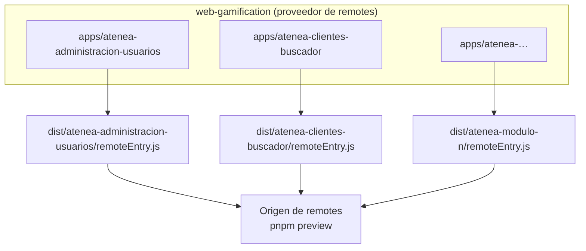
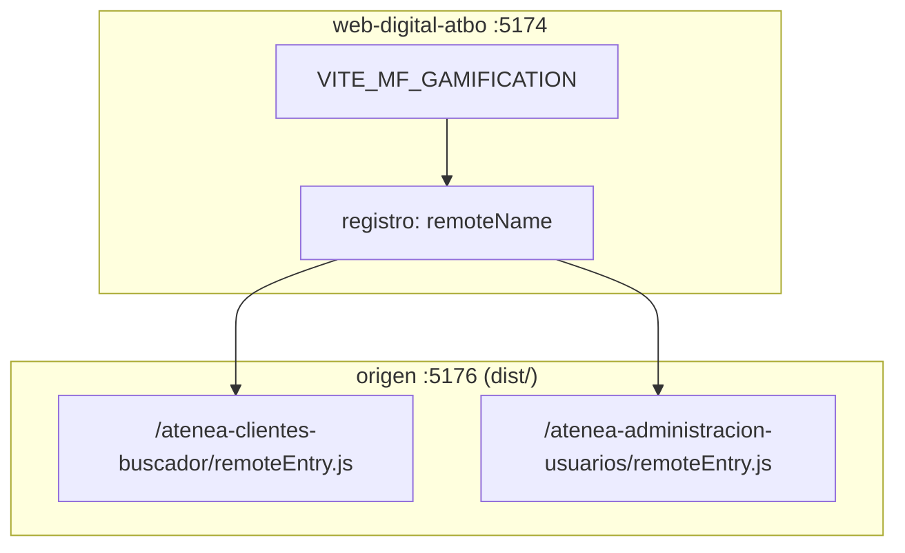
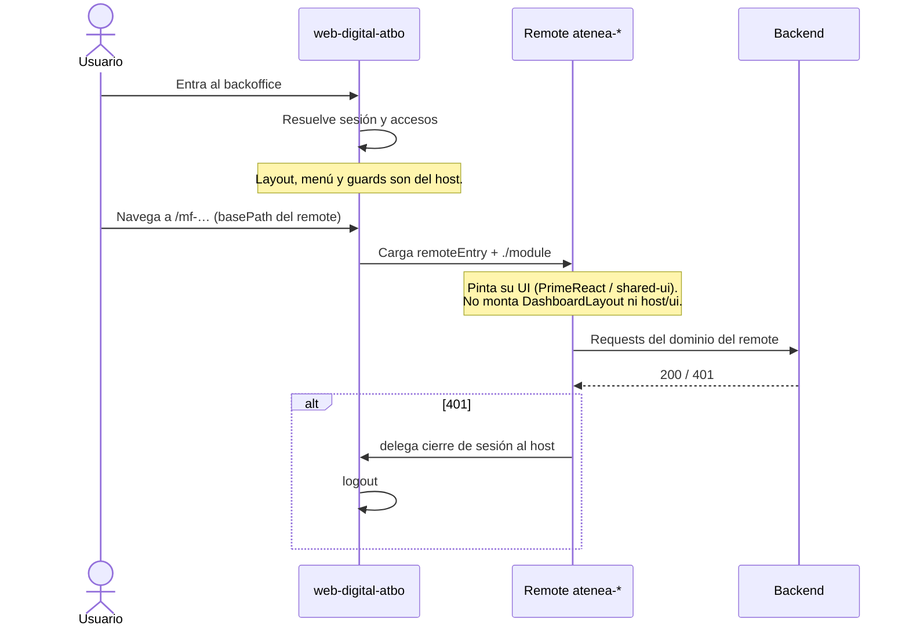
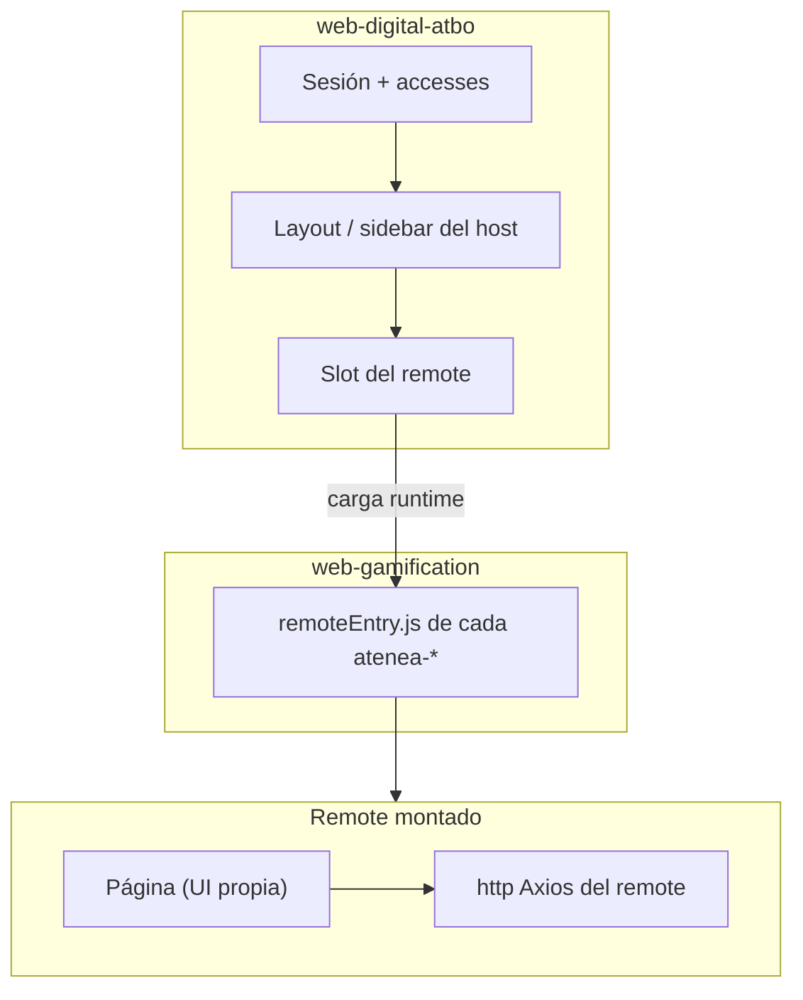

# Arquitectura: microfrontends y host ATBO

Cómo se relacionan este repo (proveedor de remotes) y el host de producto
`web-digital-atbo`.

```
apuestaTotal/
  web-digital-atbo/                         # host de producto (sesión, shell, registro MF)
  gamificacion/web-gamification/            # proveedor de remotes atenea-*
```

La guía de federation del host vive en `web-digital-atbo/MICROFRONTENDS.md`.
Este documento cubre **nuestro** rol: qué publicamos, qué consumimos y qué
deliberadamente **no** usamos del host.

---

## Resumen

| Capa          | Repo                                | Rol                                                                |
| ------------- | ----------------------------------- | ------------------------------------------------------------------ |
| **Host**      | `web-digital-atbo`                  | Dueño de la sesión, layout del backoffice y registro de remotes    |
| **Proveedor** | `web-gamification/`                 | Compila y publica `dist/atenea-…/remoteEntry.js`                   |
| **Remote**    | `apps/atenea-[modulo]-[sub-modulo]` | Pantalla de negocio. UI y estilos **propios**. No implementa login |

El flujo es:

`usuario → host ATBO (sesión) → carga remoteEntry → remote (su UI) → API`

Los remotes **no** hablan con el IdP. El host reserva un `basePath` y monta el
módulo; el remote pinta su árbol dentro del chrome del host, que monta él mismo
con `host/layout` en su `module.tsx` (ver §0).

---

## 0. Qué expone el host y qué usamos nosotros

El host publica núcleo por Module Federation (`vite.config.ts` de ATBO) y un
kit de contrato (`@atbo/mf-kit`):

| Módulo / import           | Qué es                                           | ¿Lo usa un remote de gamificación?       |
| ------------------------- | ------------------------------------------------ | ---------------------------------------- |
| `host/store`              | Store Redux + `injectReducer` / `injectApi`      | Solo si hace falta inyectar estado       |
| `host/auth`               | `useAuth()` del host (usuario, accesses, logout) | No para pintar UI; la sesión es del host |
| `host/layout`             | `DashboardLayout` (sidebar, breadcrumb)          | **Sí**, en cada `module.tsx`             |
| `host/ui`                 | Button, Card, Table, Input, … (Radix / shadcn)   | **No**                                   |
| `host/lib`                | `cn()` del host                                  | **No**                                   |
| `host/styles`             | Hoja global del host (reset + tokens ATBO)       | **No**                                   |
| `@atbo/mf-kit/contract`   | `MicrofrontendModule`, `HostContext`, versión    | Sí, para montarse en el host             |
| `@atbo/mf-kit/shared`     | Singletons (`react`, `react-dom`, router, …)     | Sí, para no duplicar React               |
| `@atbo/mf-kit/tokens.css` | Paleta y tokens del design system ATBO           | **No**                                   |

### Lineamiento de UI (hijos)

Paletas, tipografía y aspectos estéticos los define **cada dueño del
micro-front**. No hace falta alinearse con el look del host ni con otros
equipos.

En este repo eso significa:

- Componentes y tema propios: PrimeReact (`@primereact/ui`), Tailwind y
  `packages/shared-ui` de **este** monorepo.
- No importar `host/ui`, `host/styles` ni los tokens del kit para maquetar
  pantallas. `host/layout` es la excepción: da el chrome del backoffice
  (sidebar, header y breadcrumb), no estética de pantalla. Va en el `module.tsx`
  de cada app —la entrada federada— y NO en `RemoteFeature`, que lo comparte el
  modo standalone (`src/main.tsx`) y no debe depender del host.
- Iconos y widgets de producto: los nuestros (`primeicons` / `shared-ui`).

Widgets, íconos y piezas de UI que este equipo cree y quiera compartir con
otros, se tratarían más adelante como una librería tipo Bootstrap (publicable
en CDN). Eso **no está definido**: hay que conversarlo con Noe antes de
armar un kit transversal.

Lo que **sí** es contrato (no estética):

1. Exponer el módulo que el host registra (`./module` → `MicrofrontendModule`).
2. Compartir las mismas singletons de runtime (`@atbo/mf-kit/shared`) para
   no tener dos Reacts en la página.
3. Dejar la sesión (login, logout) en el host y pintar su chrome con
   `host/layout`.
4. **En local, servir los módulos en dev (`pnpm dev:remotes`), no en
   `preview`.** Un remote construido se trae su copia de React y gana el share
   scope frente al host, que corre en dev: en cuanto usa `host/layout` revienta
   con `Cannot read properties of null (reading 'useContext')`. En producción no
   pasa porque ambos lados van construidos.

---

## 1. Build — de dónde salen los módulos

`web-gamification` **no es el runtime de producto**. Compila cada remote por
separado a `dist/`.

Nomenclatura de apps:

```
atenea-[modulo]-[sub-modulo]
```

Ejemplos: `atenea-clientes-buscador`, `atenea-administracion-usuarios`.



Comandos:

```bash
pnpm build        # typecheck + remotes en mode production (sin MSW)
pnpm build:local  # remotes en mode development (VITE_USE_MOCKS=true) + copia mockServiceWorker.js a dist/
pnpm preview      # sirve dist/ como un solo origen
```

Cada remote tiene su propio `apps/<modulo>/vite.config.ts` y
`module-federation.config.ts`. El `name` de federation, `remoteBasePath`,
`outDir` y la `remoteName` en el registro del host **deben coincidir** con el
nombre de carpeta.

`vite.remotes-preview.config.ts` **solo sirve** `dist/` en preview; no
participa en el build.

Tras `pnpm preview` el origen es uno solo. Cada hijo vive en un **path**:

```
http://localhost:5176/atenea-clientes-buscador/remoteEntry.js
http://localhost:5176/atenea-administracion-usuarios/remoteEntry.js
http://localhost:5176/atenea-contenido-rachas/remoteEntry.js
```

Eso es lo que el padre tiene que apuntar. ATBO no lee la carpeta `dist/`.

---

## 2. Cómo el padre consume esos `dist/`

El host **no empaqueta** nuestros módulos. Para gamificación solo conoce **un
origen**. El registro mapea cada `remoteName` a un path:

```bash
# web-digital-atbo/.env
VITE_MF_GAMIFICATION=http://localhost:5176/
```

```
http://localhost:5176/atenea-clientes-buscador/remoteEntry.js
http://localhost:5176/atenea-administracion-usuarios/remoteEntry.js
http://localhost:5176/atenea-contenido-rachas/remoteEntry.js
```

`basePath` (`/mf-clientes-buscador`) es la ruta **dentro del SPA**. El asset
es `<origen>/<remoteName>/remoteEntry.js`.

```ts
{
  key: 'CLIENTES',
  remoteName: 'atenea-clientes-buscador',
  exposedModule: './module',
  basePath: '/mf-clientes-buscador',
  origin: 'GAMIFICATION', // misma env para todos los atenea-*
  title: 'Clientes',
  items: [{ title: 'Búsqueda', path: '' }],
}
```

Otro hijo = otra fila con el mismo `origin`. Sin `VITE_MF_CLIENTES_ENTRY` ni
`devEntry` por módulo.

| Prioridad | Dónde                                                  | Uso                               |
| --------- | ------------------------------------------------------ | --------------------------------- |
| 1         | `window.__MF_REMOTES__[KEY]`                           | Un módulo puntual, sin rebuild    |
| 2         | `VITE_MF_<KEY>_ENTRY`                                  | Override raro de un solo hijo     |
| 3         | `__MF_ORIGINS__.GAMIFICATION` / `VITE_MF_GAMIFICATION` | Origen de todos los `atenea-*`    |
| 4         | `devEntry`                                             | Remotes sueltos (Demo, Sportbook) |

```bash
# web-gamification — un dominio, un path por módulo
pnpm build:local && pnpm preview

# web-digital-atbo
VITE_MF_GAMIFICATION=http://localhost:5176/
npm run dev   # :5174
```

En deploy, sin rebuild del host:

```js
window.__MF_ORIGINS__ = {
  GAMIFICATION: 'https://cdn.ejemplo/gamificacion/',
};
```



El default export cumple `MicrofrontendModule` (`@atbo/mf-kit/contract`):

```ts
{
  contractVersion: CONTRACT_VERSION,
  routes: [/* relativas al basePath */],
  register?: (ctx) => { /* injectReducer / injectApi si aplica */ },
}
```

`HostContext` entrega `store`, `injectReducer`, `injectApi`, `basePath` y
`getState`. Es la vía oficial si un remote necesita estado en el store del
host. **No** implica usar `host/ui` ni los tokens ATBO.

El host valida `CONTRACT_VERSION` al cargar. Si no coincide, falla ese
módulo; el resto del backoffice sigue.

Hoy los remotes de este repo exponen `./page` (un componente React). El
registro ATBO pide `./module` (objeto con `routes`). Apuntar la URL no
alcanza: hay que exponer `./module` o el host corta con _«se esperaba un
default export con la propiedad routes»_. La URL y el `exposes` tienen que
casar los dos.

---

## 3. Sesión — quién autentica

**El host es el único dueño de la sesión.** Los remotes no implementan login,
no hablan con el IdP y no leen el token por su cuenta.



Permisos de menú del host (visibilidad en el sidebar) salen de `accesses` /
`canAccessRoute` de ATBO. Permisos **dentro** de una pantalla de gamificación
siguen en este repo (`HasRole` / `useAccess` / `HasPermission` sobre
`packages/shared-utils`).

No hay Keycloak local (`:8080`), realm `atenea` ni selector de cajas
`/sportbook` · `/digital` · `/gamificacion` en este flujo.

---

## 4. Vista completa



---

## 5. Qué hace cada pieza dentro del remote

El expose de federation es `./module` (contrato ATBO). Por dentro, la página
sigue envuelta con el puente de este repo cuando hace falta token / roles /
401:

```tsx
// apps/atenea-clientes-buscador/src/export-busqueda-clientes.tsx
<RemoteFeature>
  <RemoteBridge token={token} roles={roles} onUnauthorized={onUnauthorized}>
    <BusquedaClientesPage />
  </RemoteBridge>
</RemoteFeature>
```

`RemoteBridge` (`packages/shared-ui/src/remote-bridge.tsx`):

1. `setAccessToken(token)` — Bearer en el cliente `http` de `shared-utils`.
2. `AccessProvider(roles)` — `useAccess()`, `<HasPermission>`, `<HasRole>`.
3. `onUnauthorized` — si la API responde 401, el remote delega el logout al host.

| Necesidad          | Usar                                      | No usar                     |
| ------------------ | ----------------------------------------- | --------------------------- |
| Llamar a la API    | `http` de `shared-utils`                  | Cliente HTTP del host       |
| Pintar la pantalla | PrimeReact + `shared-ui` de este repo     | `host/ui`, `host/styles`    |
| Layout / sidebar   | `host/layout` en `module.tsx`             | Montarlo en `RemoteFeature` |
| Mostrar/ocultar UI | `HasPermission` / `useAccess`             | Leer el JWT a mano          |
| Cerrar sesión      | Delegar al host (`onUnauthorized` / auth) | Login o logout propios      |

---

## 6. `host-shell` vs host de producto

|         | `apps/host-shell` (este repo) | `web-digital-atbo`                          |
| ------- | ----------------------------- | ------------------------------------------- |
| Rol     | Shell standalone              | Host de producto                            |
| Auth    | Login propio / MSW            | Sesión real del backoffice                  |
| Remotes | Import del workspace          | Module Federation (`remoteEntry.js`)        |
| UI      | Mismos componentes del remote | Chrome ATBO + slot; el remote pinta lo suyo |
| Uso     | Desarrollo local, e2e         | Integración y producción                    |

`host-shell` importa el código fuente (`@gamification/atenea-…`) para trabajar
sin federation. El host de producto carga los bundles de `dist/` (o la URL de
dev del remote).

---

## 7. Puertos y URLs locales

El flujo habitual contra el padre es **un dominio de hijos** (`build-remotes`

- `preview`) y el host en otro puerto. `host-shell` también usa `:5173`: no lo
  levantes a la vez que el preview.

| Servicio                       | URL típica                                   | Qué expone                        |
| ------------------------------ | -------------------------------------------- | --------------------------------- |
| Host ATBO                      | `http://localhost:5174`                      | SPA, pide cada `remoteEntry`      |
| Hijos (`VITE_MF_GAMIFICATION`) | `http://localhost:5176/<app>/remoteEntry.js` | Todos los `dist/[modulo]/`        |
| `host-shell`                   | `http://127.0.0.1:5173`                      | Standalone de este repo, sin ATBO |

Otros remotes ajenos (referencia): Sportbook `:5175`, Demo `:5177`.

```bash
# terminal 1 — web-gamification
pnpm build:local && pnpm preview

# terminal 2 — web-digital-atbo
# VITE_MF_GAMIFICATION=http://localhost:5176/
npm run dev
```

---
